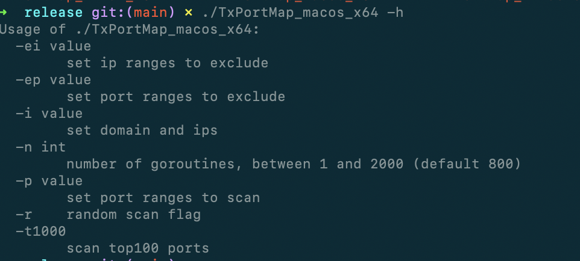
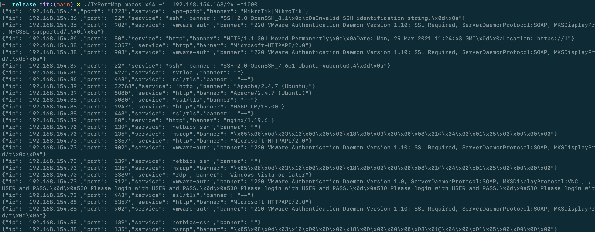
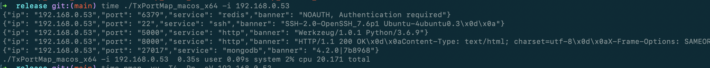
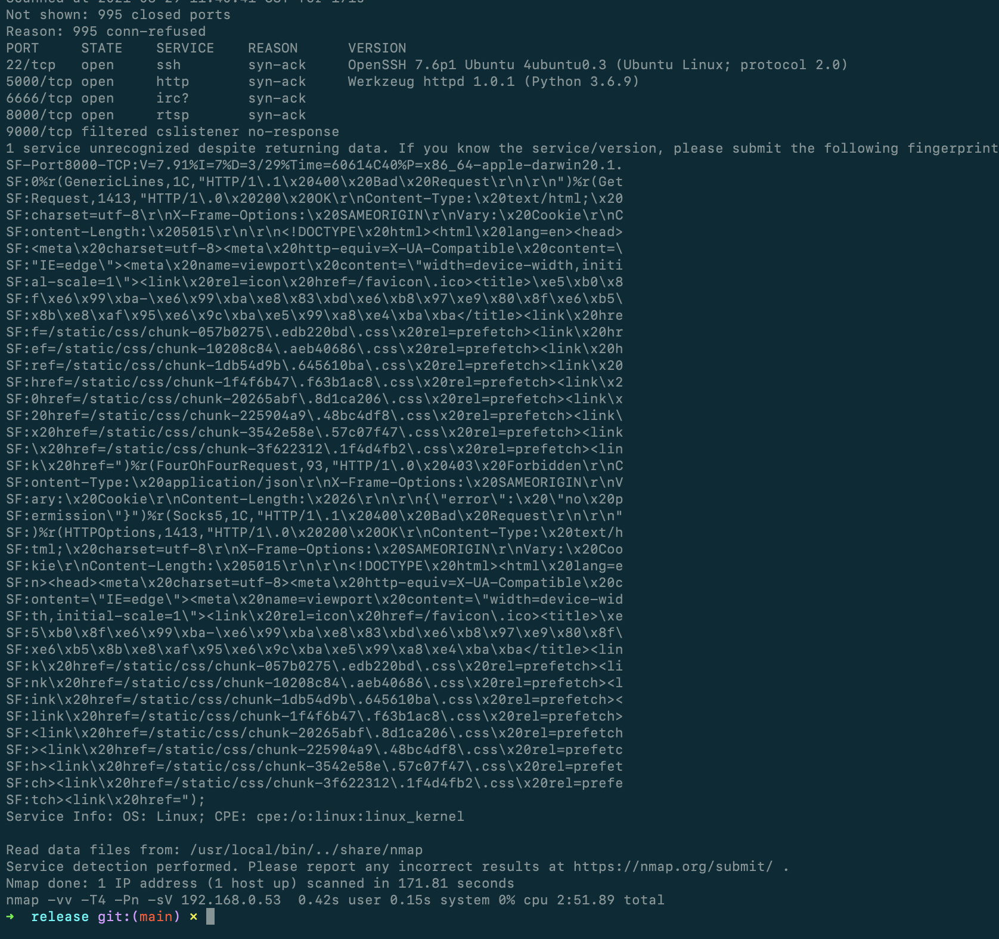

# TXPortMap
Port Scanner &amp; Banner Identify From TianXiang

```
./TxPortMap -h
```




```
TxPortMap 会直接扫描top100 加上t1000参数会扫描top1000 可以通过-p 指定端口，分号指定多个
```




# 项目说明
在渗透测试的端口扫描阶段，相信很多人遇到的问题是nmap太慢，masscan不准确。
本项目为天象渗透测试平台后端使用的端口扫描和指纹识别模块，采用Golang编写，以期在速度与准确度之间寻找一个平衡。
开源后希望大家可以一起完善指纹和提交优化建议。

TxPortMap时间：20.171秒

nmap 2分51.89秒





